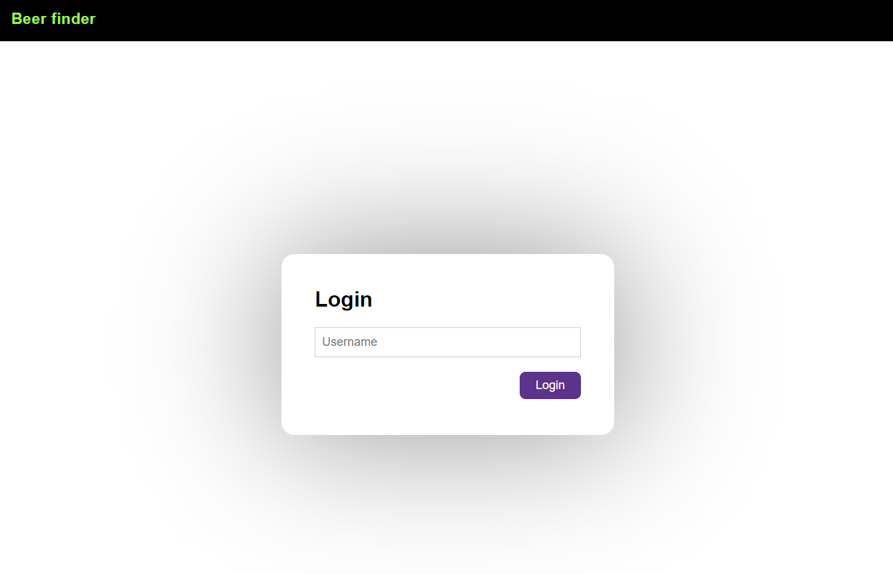
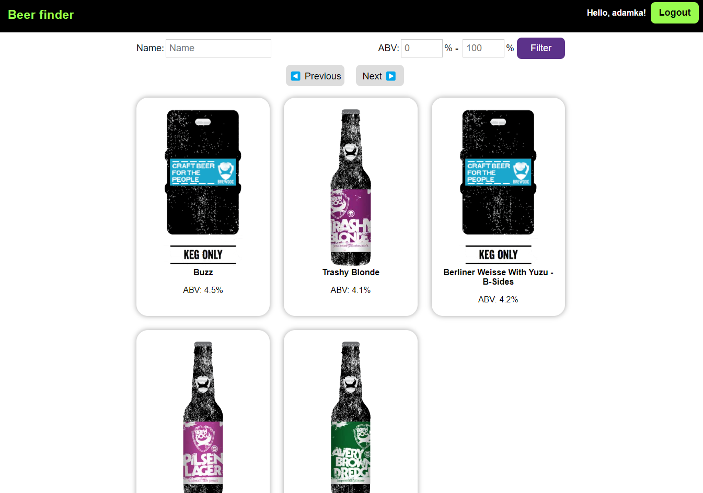
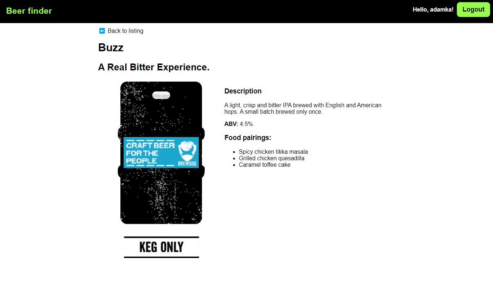

# BeerFinder

You can search and list beers with this app using the Punk API.

## Task

Read [the complete description of the task.](task.md)

## Screenshots

The app looks like these images:







## Install and run

Inside the repo folder, execute these:

1. Run `npm install`.
2. Execute `npm start` for a dev server.
3. Navigate to `http://localhost:4200/`.

## Run from Docker

Go to the repo folder and use these commands:

```
docker buildx build -t beer-finder:v01 .
docker run -p 4200:4200 beer-finder:v01
```

Please note: currently, the fetch requests are blocked by CORS when using Docker.

## License

Please read [the license file.](LICENSE)
